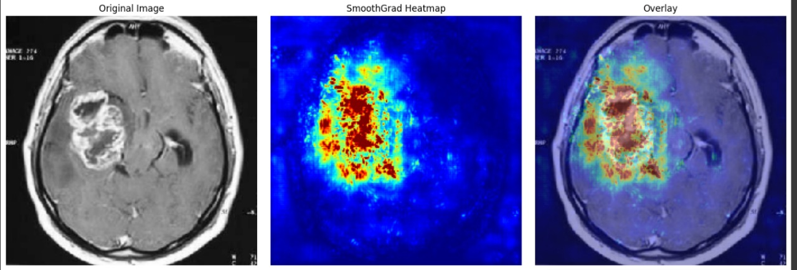

# **Brain Tumor Detection using Pretrained RadImageNet ResNet50 with SmoothGrad Visualization**

# Introduction
Brain tumors are life-threatening and early detection is critical. This project aims to build a deep learning model using MRI scans to classify whether a patient has a tumor or not.

# Problem Statement
Given a dataset of labeled brain MRI images, the goal is to build a model that can accurately classify the images into:
* Tumor
* No Tumor 

I have made this project keeping in mind that tumors during early stage are very small and cannot be easilty detected by naked eye or may be missed out by physicians. An Impoved version of this can be used as a second opnion for doctors as it is trained on pixels and it can detect any small chnages too.

# Dataset
* Source: Kaggle - [Brain MRI Images for Brain Tumor Detection](https://www.kaggle.com/datasets/navoneel/brain-mri-images-for-brain-tumor-detection)
* Format: JPEG MRI scans
* Classes: 'yes' (tumor), 'no' (no tumor)
* Size: 253 images total

Due to the small size of the dataset I have decided to use a pre trianed model trained on RadImageNET images that is a specific dataset consisting of radiological images. Besides that I have also used Image Augmentation to increase the number of images to train on.

# Features
* Added **Smooth Grad Visualization** to interpret where our model is looking for predictions
* Used **RadImageNET** pretrained model for better generalizing ability of the model
* Made a Flask App with the features to visualize the smoothgrad heatmap overlayed on the real image
* Used **ROC** and **AUC** to find the best threshold

# Example Visualization

Here we can clearly see the model is able to focus on the tumor region without much outside noise.

# Tech Stack
* Frontend: HTML
* Backend: Flask (Python)
* Deep Learning: Tensorflow, Keras, RadImageNET(ResNET50)
* Image Processing: Numpy, OpenCV 

